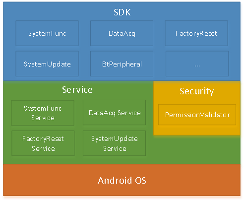

# 开发者指南

## Titan整体架构

如上所示，Titan框架主要分由以下几个层次构成：

* SDK
* Service
* Android OS

### SDK
即titanapi.jar, 包含了定制系统为上层调用提供的接口，开发应用程序时需要把titanapi.jar导入到工程里。

### Service
即各个系统服务，如SystemFunctionService, DataAcqService等底层系统服务。这些服务一般由系统预置，开机启动。开发者需要关注的是titanapi.jar与各系统服务的版本依赖关系。这些关系可以在[版本](../versions/README.md)中找到对应的最低依赖关系。当版本不满足时，调用api会抛出异常或返回错误码。

### Android OS
在原生系统上定制了厂商功能的基础运行环境。
