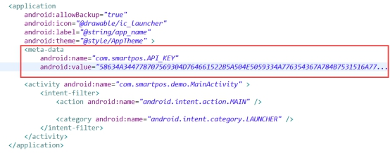

# 鉴权方式

目前系统统一接口服务为每一个提供给开发者的API都定义了安全等级：

NORMAL：普通权限等级，不要求应用具备任何权限均可以调用，这部分API主要用于查询不敏感的系统功能，如系统语言，输入法，系统时间等。

MANAGER：管理权限等级，要求应用具备特定权限才可以调用，这部分API涉及系统安全，稳定性，改变系统属性等敏感操作，如设置系统语言，更新开机动画等。    

 

调用MANAGER等级及以上API，要求应用必须通过以下某种鉴权方式，如果所有鉴权方式都不通过，则应用调用API会抛出安全异常。

 

使用系统统一接口服务框架，应用调用管理等级权限的API时，要求应用具有能够表明应用合法性的身份证明，如应用签名方式。接口服务框架支持应用三种安全检查机制。

* 扩展权限鉴权 
* 签名证书鉴权 
* API密钥鉴权

## 扩展权限鉴权

扩展权限是对于每个接口的访问权限进行单独定义。在对APK进行签名的过程中，会将已授权的权限打在该APK的签名信息中。
在APK安装成功之后，相关的扩展权限信息会被提取并妥善保存。当该应用要访问相关的接口时，对应的底层服务，会检查调用者是否拥有所需要的权限。 

### 签名证书鉴权

签名证书鉴权指的应用使用联迪签名方案，联迪分配签名证书给应用签名，系统服务通过APK签名者信息来识别应用身份。系统服务要求应用签名者的身份等级不小于API的安全等级，API权限检查才能通过。即，某一API安全等级为MANAGER（权值为2），那么要求应用签名者身份等级要高于或等于MANAGER等级。

### API密钥鉴权
API密钥鉴权指的应用不使用联迪签名方案，但需要向联迪申请应用的身份密钥，密钥使用非对称加密算法（RSA算）对应用的身份信息进行加密，生成一串指纹数据（API_KEY），系统服务检测应用API_KEY。通过身份检查，应用即可调用接口服务提供的所有API。

指纹信息（API_KEY）生成规则如下：

第三方应用提供应用包名以及签名哈希值SHA256（从keystore提取），联迪将包名跟SHA256通过联迪统一接口私钥加密生成一串指纹信息（API_KEY）,开发者将指纹信息在应用AndroidManifest.xml中声明,如下：

